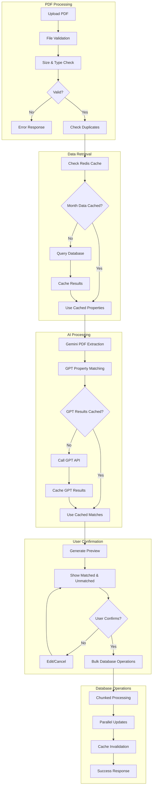
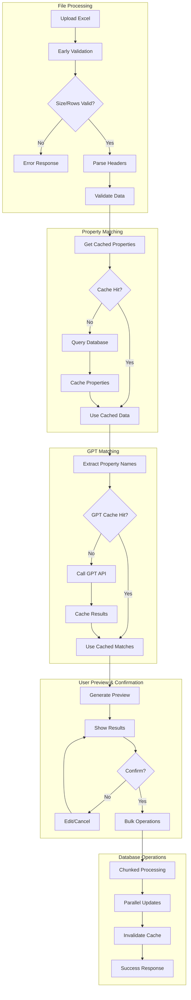
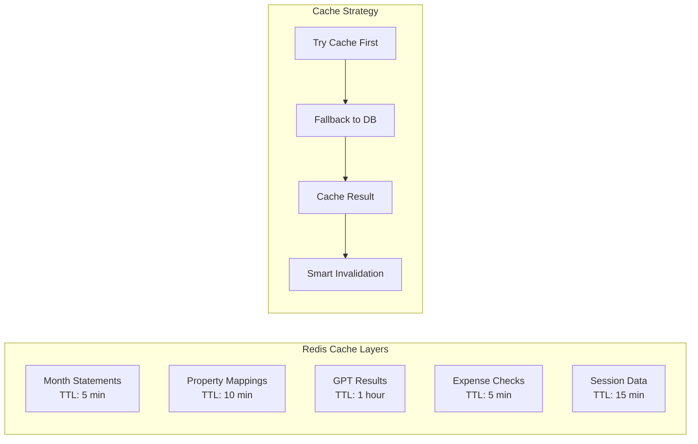

# Vendor Import Architecture

## Overview

The vendor import system handles both PDF and Excel files, using AI-powered property matching with a preview/confirmation workflow. The system includes caching, bulk operations, and early validation.

## System Architecture

```mermaid
flowchart TB
    subgraph "Import Flow"
        A[User Uploads File] --> B[Early Validation]
        B -->|Valid| C[Cache Check]
        B -->|Invalid| X[Error Response]

        C --> D{Cache Hit?}
        D -->|Hit| E[Use Cached Data]
        D -->|Miss| F[Database Query]

        F --> G[Cache Result]
        G --> E

        E --> H[AI Processing]
        H --> I{GPT Cache Hit?}
        I -->|Hit| J[Use Cached Match]
        I -->|Miss| K[GPT API Call]

        K --> L[Cache GPT Result]
        L --> J

        J --> M[Generate Preview]
        M --> N[User Reviews & Confirms]
        N --> O[Bulk Database Operations]

        O --> P[Parallel Updates]
        P --> Q[Cache Invalidation]
        Q --> R[Success Response]
    end
```



## PDF Import Flow



## Excel Import Flow



## Caching Architecture



## Code Organization

### Client Components

```typescript
// MonthlyVendorImporter.tsx - PDF Upload & Processing
- File validation (size, type)
- 4-step progress indicator
- Preview with matched/unmatched properties
- Confirmation workflow with edit capabilities

// VendorExcelImporter.tsx - Excel Upload & Processing
- Excel parsing with validation
- Property matching preview
- Bulk confirmation workflow
- Error handling with feedback
```

### Server-Side Logic

```typescript
// ownerStatement.ts - Core Business Logic
- getCachedMonthProperties() - Property fetching with caching
- getCachedGPTMatching() - AI result caching
- Bulk database operations with chunking
- Cache invalidation on data changes

// process/route.ts - PDF Processing
- Gemini AI integration with caching
- Duplicate checking
- GPT matching with cache layer
- Preview data generation

// confirm/route.ts - Final Confirmation
- Bulk expense creation (300 per chunk)
- Parallel statement updates
- Transaction handling
- Cache invalidation
```

### Utility Services

```typescript
// vendor-cache.ts - Caching Layer
- Multi-level Redis caching
- TTL management
- Cache invalidation
- Hash-based cache keys

// kv.ts - Redis Interface
- Environment-based prefixes
- Type-safe operations
- Serialization
```

## Database Operations

- **Bulk Operations**: `createMany()` with `skipDuplicates: true`
- **Chunked Processing**: 300 expenses per transaction
- **Parallel Processing**: `Promise.all()` for concurrent operations
- **Early Validation**: Pre-transaction data validation
- **Smart Queries**: Select only required fields

## Validation Pipeline

- **File Size**: 10MB limit
- **File Type**: PDF/Excel validation before processing
- **Row Limits**: 1000 expense limit for Excel files
- **Header Validation**: Required columns check
- **Duplicate Detection**: Existing expense checking

## User Experience Features

### Progress Indicators

- 4-step visual progress (Upload → Processing → Preview → Confirm)
- Real-time status messages
- Processing time estimates
- Cancellation support

### Preview & Confirmation

- **Matched Properties**: Show confidence scores and reasoning
- **Unmatched Properties**: Clear identification of unprocessed items
- **Edit Capabilities**: Modify mappings before confirmation
- **Summary Statistics**: Totals and counts for review

### Error Handling

- **Early Validation**: Immediate feedback on file issues
- **Graceful Degradation**: Fallback strategies for API failures
- **Detailed Errors**: Specific messages with actionable guidance
- **Recovery Options**: Retry and edit capabilities

## GPT Matching Capabilities

The system can intelligently match:

- **Name to Name**: "Sunset Villa" → "Sunset Villa Apartments"
- **Address to Address**: "123 Main St" → "123 Main Street, Apt 1"
- **Name to Address**: "Ocean View" → "456 Ocean View Drive"
- **Address to Name**: "789 Pine Street" → "Pine Street Condo"
- **Partial Matches**: "Main St Unit 2" → "123 Main Street Apartment 2"
- **Normalization**: Handles abbreviations, spacing, punctuation automatically

## Security Considerations

- **File Validation**: Strict file type and size checking
- **Data Sanitization**: Clean all user inputs
- **Access Control**: Organization-level data isolation
- **Cache Security**: Prefixed keys prevent data leakage
- **Transaction Safety**: Atomic operations with rollback support
